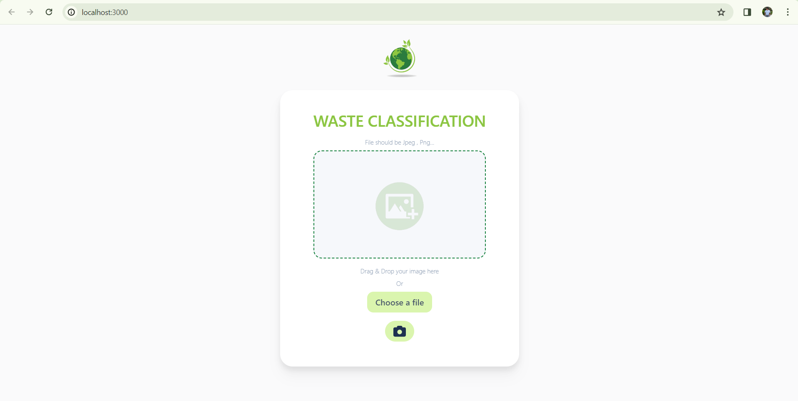
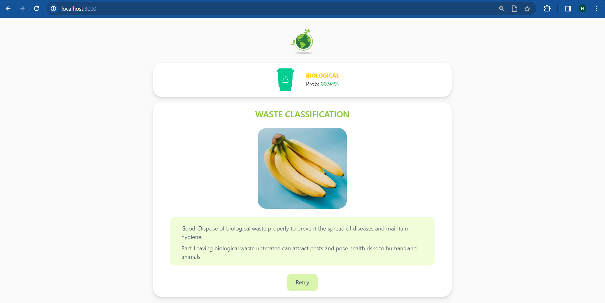
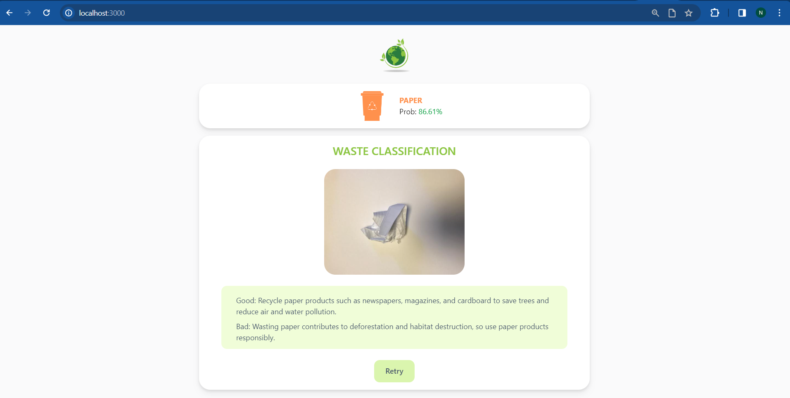
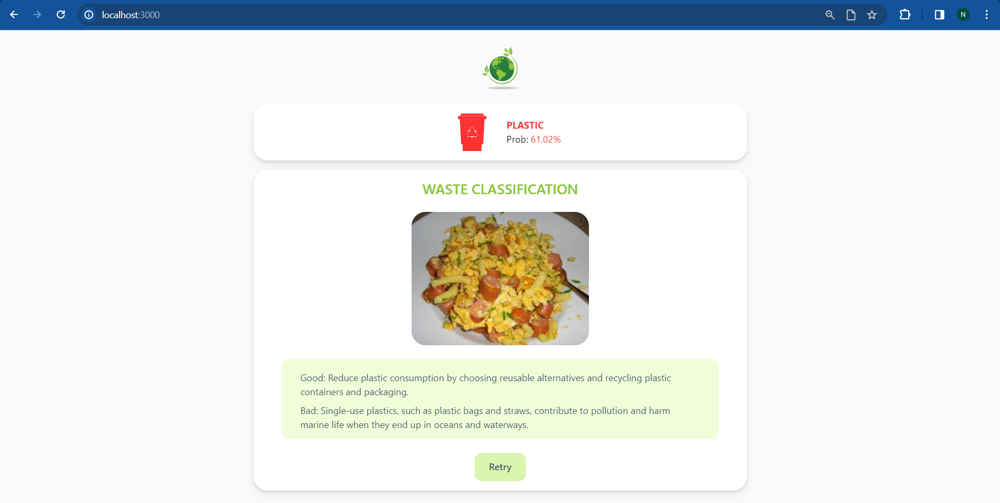
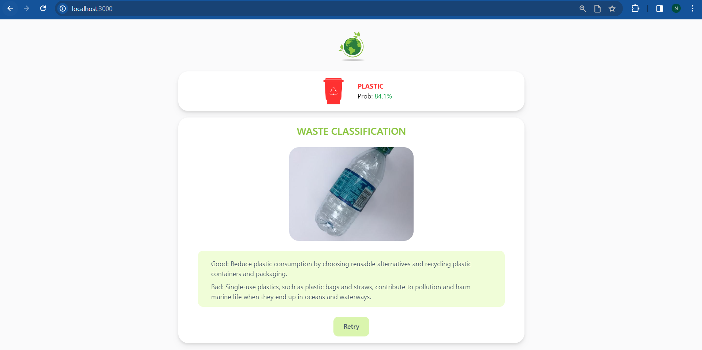

# Waste detection using faster-rcnn (resnet50)

> [!IMPORTANT]
> Please note that the accuracy of the classification may be limited as the model is trained on a small dataset.
> 

## Overview

This project implements waste object classification using the Faster R-CNN algorithm with a ResNet50 model. The backend is developed in Python, utilizing the TensorFlow framework for training and inference. The frontend is developed using React for the user interface.

# Setup
> [!NOTE]
> Make sure you have Python (above `v3.9`) and node (above `v16.0`) installed on your system before running the project.


## 1. Download Repository
 **Clone the repository:**
```bash
git clone https://github.com/G-nizam-A/Waste-Classification.git
```
### or

**Direct download zip file: [link](https://github.com/G-nizam-A/Waste-Classification/archive/refs/heads/main.zip) [90MB]**


## 2. Backend setup


1. Open a terminal or vs code.
2. Navigate to the backend directory:
```bash
cd backend
```
3. Install required libraries : (Only for initial setup)
```bash
pip install -r requirements. txt
```
3. Run the application:
```bash
python main.py
```

## 3. Frontend setup

1. Open a terminal or vs code.
2. Navigate to the frontend directory:
```bash
cd frontend
```
3. Install node_modules: (Only for initial setup)
```bash
npm i
```
3. Run the application:
```bash
npm start
```
4. Open browser:
```bash
http://localhost:3000/
```

## Screenshots








## Contribution

Contributions are welcome and encouraged! If you would like to contribute to this project, please follow these steps:

1. Fork the repository.
2. Create a new branch for your feature or bug fix: `git checkout -b feature-name`.
3. Make your changes and commit them: `git commit -m 'Description of your changes'`.
4. Push to the branch: `git push origin feature-name`.
5. Submit a pull request detailing your changes.

Your contributions help improve this project for everyone!

## Show Your Support

If you find this project useful, please consider giving it a star ⭐. Your support is greatly appreciated!.
Thank You.
@[Nizam](https://github.com/G-nizam-A)

